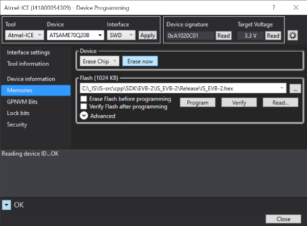
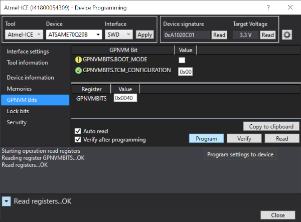

# EVB-2

## Hardware 

The Inertial Sense EVB 2.x is a development board which contains the Inertial Sense µINS, µAHRS, or µIMU module. The EVB 2.x builds on the foundation established by the EVB 1.x, but adds these and other new features:

- 915MHz Xbee radio for RTK (real-time-kinematics)
- Wi-Fi and Bluetooth Low energy (BLE) for remote data viewing and logging operation
- Onboard logging to micro SD card.
- Dual antenna ports for GPS compassing
- Companion Microchip SAME70 processor that serves as a communication bridge between the µINS, µAHRS, or µIMU and all other interfaces.

More details on the EVB-2 can be found in the [Inertial Sense online documentation](<https://docs.inertialsense.com/user-manual/hardware/EVB2/>)

## Firmware

The EVB-2 project source code is open source and available in the inertial-sense-sdk.  It serves as a dev kit example project for the following applications: 

- RTK positioning, base or rover with 900MHz radio and WiFi radios.
- RTK compassing, moving baseline RTK for a dual GNSS heading solution.
- External uBlox [ZED-F9P multi-frequency GNSS](https://docs.inertialsense.com/user-manual/gnss/multi_frequency_gnss/) for simultaneous RTK positioning and RTK compassing.
- [uINS SPI](https://docs.inertialsense.com/user-manual/hardware/EVB2/#spi) interface
- [uINS CAN](https://docs.inertialsense.com/user-manual/com-protocol/CAN/) interface

Because the EVB-2 project is open source, itself can be customized by users to meet various needs.

### Compiling EVB-2 Firmware

##### Atmel Studio

###### Install

Installer link: https://www.microchip.com/avr-support/atmel-studio-7
(Downloads are near the bottom of the page.)
Download the installer and take all of the default options during installation.

###### Building

1. Open SDK\EVB-2\IS_EVB-2.atsln
1. Click Build Menu -> Build Soution (F7)
	a. If using JTAG programmer the firmware will be flashed to EVB-2.

##### **Ubuntu**

###### **Install toolchain**

In order to build you need to install the gcc-arm embedded toolchain. Run these commands to install it:

```bash
# Install 32-bit dependencies
sudo apt install -y lib32ncurses5 

# Download toolchain version 6.3.1 6-2017-q2
wget https://developer.arm.com/-/media/Files/downloads/gnu-rm/6-2017q2/gcc-arm-none-eabi-6-2017-q2-update-linux.tar.bz2

# Unzip file
tar -xf gcc-arm-none-eabi-6-2017-q2-update-linux.tar.bz2

# Move it to the opt directory
sudo mv gcc-arm-none-eabi-6-2017-q2-update /opt/

# Add the compiler to the path
echo "export PATH=\$PATH:/opt/gcc-arm-none-eabi-6-2017-q2-update/bin/" >> ~/.bashrc

# Delete the downloaded file
rm -rf gcc-arm-none-eabi-6-2017-q2-update-linux.tar.bz2

# Re-source your .bashrc to get the updated $PATH
source ~/.bashrc

# Print gcc toolchain version info
arm-none-eabi-gcc --version
```

###### **Building**

Run `make` within the EVB-2 directory .

### Loading Firmware onto EVB-2

The EVB USB port on the EVB-2 must be used to update the EVB-2 firmware.

##### EvalTool

1. Enter the Settings tab
2. Open the COM ports of the units that need to be updated
   1. If the units don't open up, the baud rate may need changed
3. Click, "Update Firmware"
4. Navigate to the directory where the newly built .hex file is located
5. Select it and press "Open"
6. Wait for the firmware to fully load

##### CLTool

Use the -b command line flag. See the CLTool [help menu](<https://docs.inertialsense.com/user-manual/software/cltool/#help-menu>).

##### SDK

Use the function bootloadFile() to load firmware onto the EVB-2. See [SDK Docs](<https://docs.inertialsense.com/user-manual/software/SDK/#sdk>).

### Chip Erase Using Atmel-ICE

The EVB-2 SAM-E70 can be chip erased using the Atmel-ICE JTAG (SWD) interface and Atmel Studio.  The following steps describe how to erase the contents of the SAM-E70 and then reload the bootloader and firmware.  

1. Open the **Device Programming** dialog in Atmel Studio -> Tools -> Device Programming.
2. Select Tool: **Atmel-ICE**, Device: **ATSAME70Q20B**, Interface: **SWD** and click Apply.
3. Click the **Device Signature Read** button to ensure communication works properly. 
4. Go to the Memories area and click Erase Chip - **Erase now** button.  This will erase all of the contents on the processor.



5. Go to the GPNVM Bits area and **uncheck** the GPNVMBITS.BOOT_MODE checkbox and click the program button.  This will put the processor into bootloader update mode. 



6. Follow the standard bootloader and firmware update process, using either the [EvalTool](https://docs.inertialsense.com/user-manual/software/evaltool/#update-firmware) or [CLTool](https://docs.inertialsense.com/user-manual/software/cltool/#update-the-firmware).  The bootloader must be loaded first followed by the firmware.

## SPI

SPI communication has been implemented between the EVB-2 communications hub and the uINS device to demonstrate how to properly communicate with a uINS using SPI. Details of the SPI communications protocol can be found in the [Inertial Sense Online Documentation](https://docs.inertialsense.com/user-manual/com-protocol/SPI/).

SPI communication between the uINS and the EVB-2 processor is enabled by setting the appropriate bit of DID_EVB_FLASH_CFG.[cbOptions](https://docs.inertialsense.com/user-manual/com-protocol/DID-descriptions/#did_evb_flash_cfg). 

The main implementation of the SPI protocol exists in spiTouINS.c.


